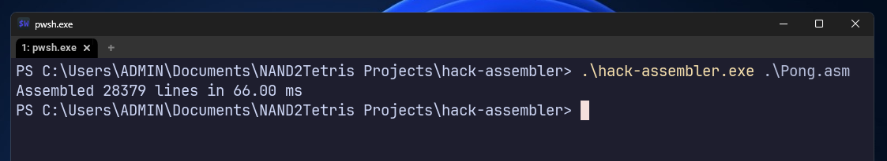

# HACK Assembler

This is as an assembler for the HACK programming language written in C. Part of project 6 of the NAND2Tetris course ([nand2tetris.org](https://nand2tetris.org)).

[Read the Language Specification](https://www.nand2tetris.org/_files/ugd/44046b_7ef1c00a714c46768f08c459a6cab45a.pdf)

**Coded in plain C with absolutely NO dependencies.**
Blazingly fast assembly. Compile using:

```c
cc main.c helpers.c resolver.c mappings.c -o hack-assembler.exe
```



## License

Published under the [GNU GPLv3 License](https://www.gnu.org/licenses/gpl-3.0.en.html)